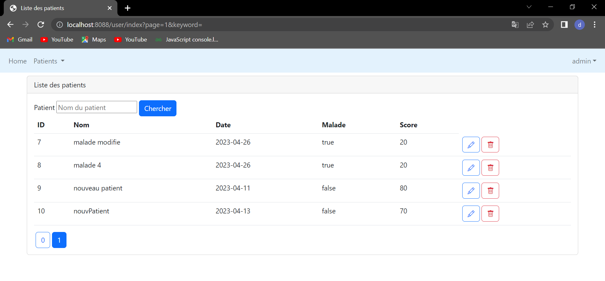

<H1 align="center">Les captures d'écran du tp3 et tp4</H1>

 
        - Structure du projet    
                
        - Excecution du code    
                
        - La base de données 
                 
               
        -Espace Admin 
                 
                 
                 

        -Ajouter Patient 
                 
                 
        -Supprimer Patient 
                   
        -Chercher Patient 
                
        -Modifier patient 
                

   -Espace user 
                  
                  
        -Properties
                  

