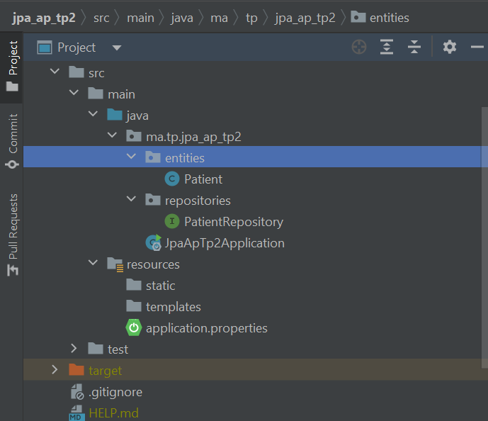
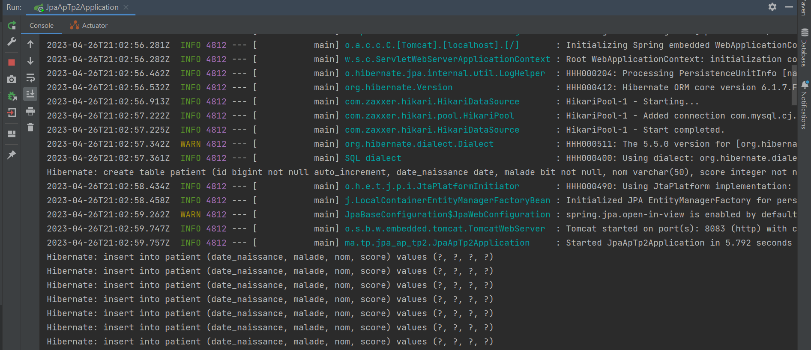
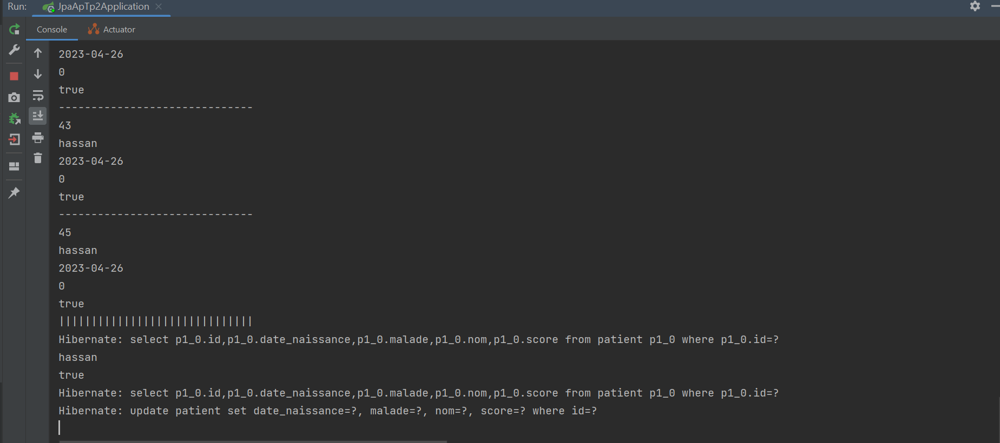
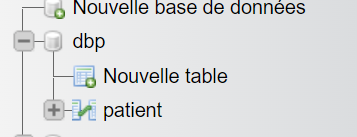
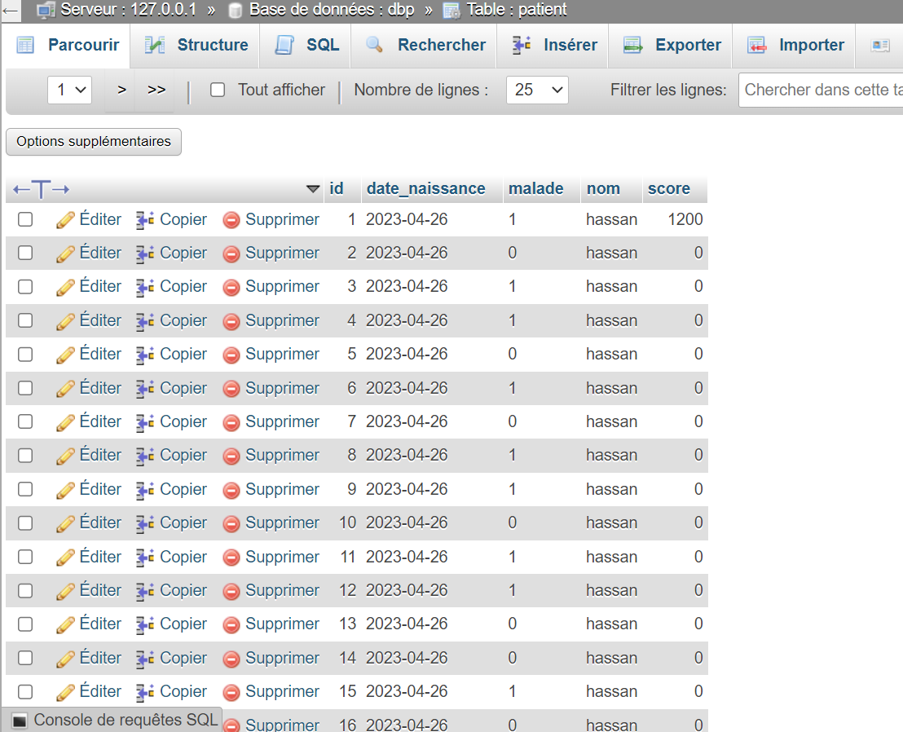

<H1 align="center">Les captures d'écran du tp2</H1>

 
        - Structure du projet    
                
        - Excecution du code    
                 
               
        - Chercher les patients  
                
        - La base de données 
                 
               
        -

